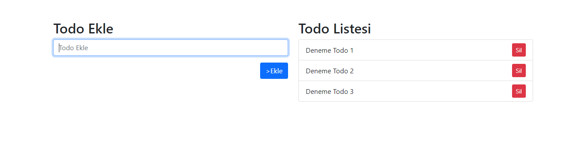

# TodoApp
Bu proje, basit bir Todo uygulamasıdır ve tüm işlemler anlık olarak sayfada gösterilmektedir. Kullanıcılar, görevlerini ekleyebilir, listeleyebilir ve silebilirler. İşlemler, API üzerinden yapılır ve AJAX kullanılarak sayfa yeniden yüklenmeden güncellenir.

## Ekran Görüntüsü

